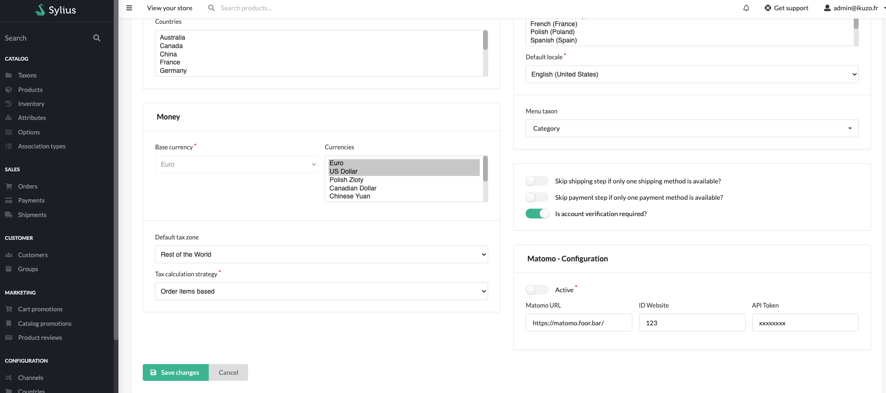

<p align="center">
    <a href="https://sylius.com" target="_blank">
        
    </a>
</p>

<h1 align="center">Matomo Plugin</h1>

<p align="center">Integrate Matomo ecommerce tracking into Sylius.</p>
<p align="center">/!\ Currently in alpha /!\</p>

## Quickstart


```
$ composer require ikuzostudio/matomo-plugin
```

Add plugin dependencies to your `config/bundles.php` file:

```php
return [
  // ...
  Ikuzo\SyliusMatomoPlugin\IkuzoSyliusMatomoPlugin::class => ['all' => true],
];
```

Import required config in your `config/packages/_sylius.yaml` file:

```yaml
# config/packages/_sylius.yaml

imports:
  ...
  - { resource: "@IkuzoSyliusMatomoPlugin/Resources/config/app/config.yaml"}
```


Extend your Channel entity
```php
// [...]
use Sylius\Component\Core\Model\Channel as BaseChannel;
use Ikuzo\SyliusMatomoPlugin\Model\MatomoChannelInterface;
use Ikuzo\SyliusMatomoPlugin\Model\MatomoChannelTrait;

/**
 * @ORM\Table(name="sylius_channel")
 * @ORM\Entity()
 */
class Channel extends BaseChannel implements MatomoChannelInterface
{
  use MatomoChannelTrait;
}
```


Update your database

```
$ bin/console doctrine:schema:update --force
```

Then configure your credentials from channel form 




